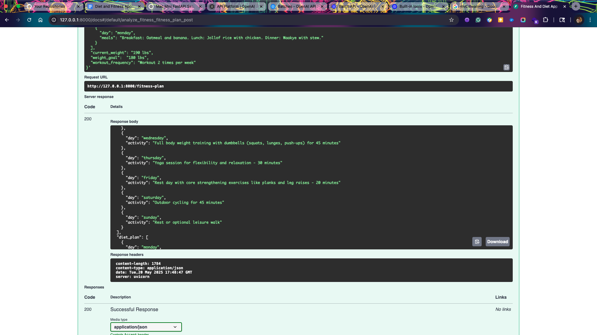
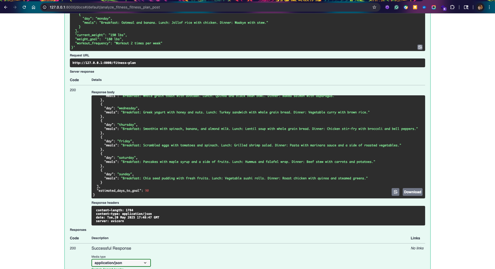
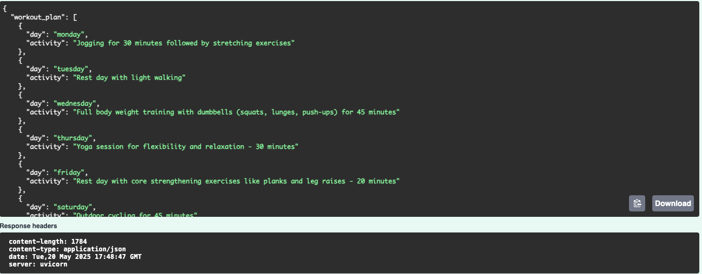

# Fitness And Diet App

A comprehensive FastAPI-based web application that leverages AI to generate personalized fitness and diet plans. This application helps users achieve their weight goals by analyzing their current eating habits, dietary preferences, weight goals, and workout preferences to create customized 7-day workout and diet plans. The app also provides an estimate of how long it will take to reach their weight goal based on the generated plans.

## Overview

The Fitness And Diet App is a full-stack solution that combines:

1. **User Authentication System**: Secure signup and login functionality using OAuth2 with JWT tokens
2. **Database Integration**: Persistent storage of user accounts, fitness plans, workout schedules, and diet plans
3. **AI-Powered Plan Generation**: Two-stage AI pipeline using OpenAI's models to create personalized plans and estimate progress
4. **RESTful API**: Well-structured endpoints for user registration, authentication, plan generation, and retrieval
5. **Cultural Sensitivity**: Special attention to respecting users' existing dietary habits and cultural preferences

## Features

- **Personalized Workout Plans**: Generate 7-day workout schedules based on user preferences
- **Culturally Sensitive Diet Plans**: Create 7-day meal plans that respect the user's current eating habits
- **Progress Estimation**: Predict how many days it will take to reach weight goals
- **AI-Powered**: Utilizes OpenAI's GPT-o3 & GPT-4o amodel for intelligent recommendations

## Installation

1. Clone the repository:
   ```
   git clone https://github.com/yourusername/diet_fitness.git
   cd diet_fitness
   ```

2. Create and activate a virtual environment (optional but recommended):
   ```
   python -m venv venv
   source venv/bin/activate  # On Windows: venv\Scripts\activate
   ```

3. Install dependencies:
   ```
   pip install -r requirements.txt
   ```

4. Create a `.env` file in the root directory with your OpenAI API key:
   ```
   OPENAI_API_KEY=your_openai_api_key_here
   ```

5. Set up the database:
   - For detailed instructions on setting up the database with Docker, see [DOCKER_SETUP.md](DOCKER_SETUP.md)
   - For information on running database migrations, see [README_MIGRATIONS.md](README_MIGRATIONS.md)

6. Authentication setup:
   - For details on the authentication implementation, see [README_AUTH.md](README_AUTH.md)

## Usage

1. Start the FastAPI server:
   ```
   uvicorn app.main:app --reload
   ```

2. Access the API documentation at `http://localhost:8000/docs`

3. Use the `/fitness-plan` endpoint to submit your information and receive a personalized plan:
   - Weekly meals for each day
   - Current weight
   - Weight goal
   - Workout frequency

## API Endpoints

### Authentication Endpoints
- **POST /auth/signup**: Register a new user account with username, email, and password
- **POST /auth/login**: Authenticate a user and receive a JWT access token

### Fitness Plan Endpoints
- **POST /api/fitness-plan**: Submit user information and receive a personalized fitness and diet plan (requires authentication)
- **GET /api/my-plans**: Retrieve all previously generated fitness and diet plans for the current user (requires authentication)

## Project Structure

```
diet_fitness/
├── app/
│   ├── __init__.py
│   ├── main.py                  # FastAPI application entry point
│   ├── auth/                    # Authentication modules
│   ├── db/                      # Database models and connection
│   └── diet_fit_app/
│       ├── __init__.py
│       ├── controller.py        # API endpoints definition
│       ├── models.py            # Pydantic data models
│       └── service.py           # Business logic and AI integration
├── migrations/                  # Database migration files
├── requirements.txt             # Project dependencies
├── test_app.py                  # Basic app import test
├── README.md                    # Project documentation
├── DOCKER_SETUP.md              # Docker setup instructions
├── README_AUTH.md               # Authentication documentation
├── README_MIGRATIONS.md         # Database migrations guide
└── TASKS.md                     # Implementation plan
```

For a detailed implementation plan for user authentication and database integration, see [TASKS.md](TASKS.md).

## How It Works

The application follows a comprehensive workflow to deliver personalized fitness and diet plans:

### 1. User Authentication Flow
- Users register with a username, email, and password
- Passwords are securely hashed before storage in the database
- Upon login, users receive a JWT token for authenticating subsequent API requests
- All fitness plan operations require valid authentication

### 2. AI-Powered Plan Generation Pipeline
The application uses a sophisticated two-stage AI pipeline to generate personalized fitness and diet plans:

#### Stage 1: Plan Generation (GPT-03 Model)
- Takes detailed user input including:
  - Current weight and weight goal
  - Workout frequency preferences
  - Typical meals (breakfast, lunch, dinner, snacks)
  - Dietary restrictions and preferences
  - Favorite meals and comfort foods
  - Eating out habits
- Generates a culturally sensitive 7-day workout plan with specific activities for each day
- Creates a personalized 7-day diet plan that respects the user's existing eating habits and preferences

#### Stage 2: Progress Estimation (GPT-4o Model)
- Analyzes the generated workout and diet plans
- Considers the intensity, frequency, and consistency of the proposed routine
- Estimates how many days it will take for the user to reach their weight goal
- Provides this timeline as part of the final plan

### 3. Data Persistence
- All generated plans are stored in the database and associated with the user's account
- Users can retrieve their previously generated plans at any time
- The database maintains separate tables for user accounts, plans, workouts, and diet details

The AI models are integrated using the Pydantic-AI library, which provides a structured way to define AI agents and their inputs/outputs, ensuring type safety and consistent data handling throughout the application.

## Dependencies

- FastAPI: Web framework for building APIs
- Uvicorn: ASGI server for running FastAPI
- Pydantic: Data validation and settings management
- Pydantic-AI: Extension for AI model integration
- Python-dotenv: Environment variable management
- OpenAI: AI model provider
- Google Generative AI: Alternative AI model provider
- HTTPX: HTTP client for async requests

## Example Request

```json
{
  "typical_breakfast": "Hausa koko with koose, tea with bread and eggs, or Choco Milo with bread",
  "typical_lunch": "Jollof rice with fried chicken, Banku with okra stew, or Kenkey with fried fish and pepper",
  "typical_dinner": "Waakye with gari and spaghetti, Yam with palava sauce, or Light soup with fufu",
  "typical_snacks": "Fruits, nuts, kelewele, or bofrot",
  "dietary_restrictions": "No specific restrictions",
  "favorite_meals": "Jollof rice with chicken, Banku with tilapia, Fufu with light soup",
  "comfort_foods": "Kelewele, Waakye, Fufu with palm nut soup",
  "eating_out_frequency": "Once a week",
  "eating_out_choices": "Local restaurants serving traditional Ghanaian dishes, occasionally fast food",
  "current_weight": "190 lbs",
  "weight_goal": "Lose 15 lbs (target: 175 lbs)",
  "workout_frequency": "Workout 3 times per week"
}
```


## Screenshots

The application includes a user-friendly interface for submitting information and viewing personalized plans:


*The user input form where users enter their dietary preferences, current weight, and goals*


*A sample 7-day workout plan generated by the AI based on user preferences*


*A culturally sensitive 7-day meal plan with progress estimation timeline*


## License

MIT License

Copyright (c) 2025 Diet Fitness App

Permission is hereby granted, free of charge, to any person obtaining a copy
of this software and associated documentation files (the "Software"), to deal
in the Software without restriction, including without limitation the rights
to use, copy, modify, merge, publish, distribute, sublicense, and/or sell
copies of the Software, and to permit persons to whom the Software is
furnished to do so, subject to the following conditions:

The above copyright notice and this permission notice shall be included in all
copies or substantial portions of the Software.
